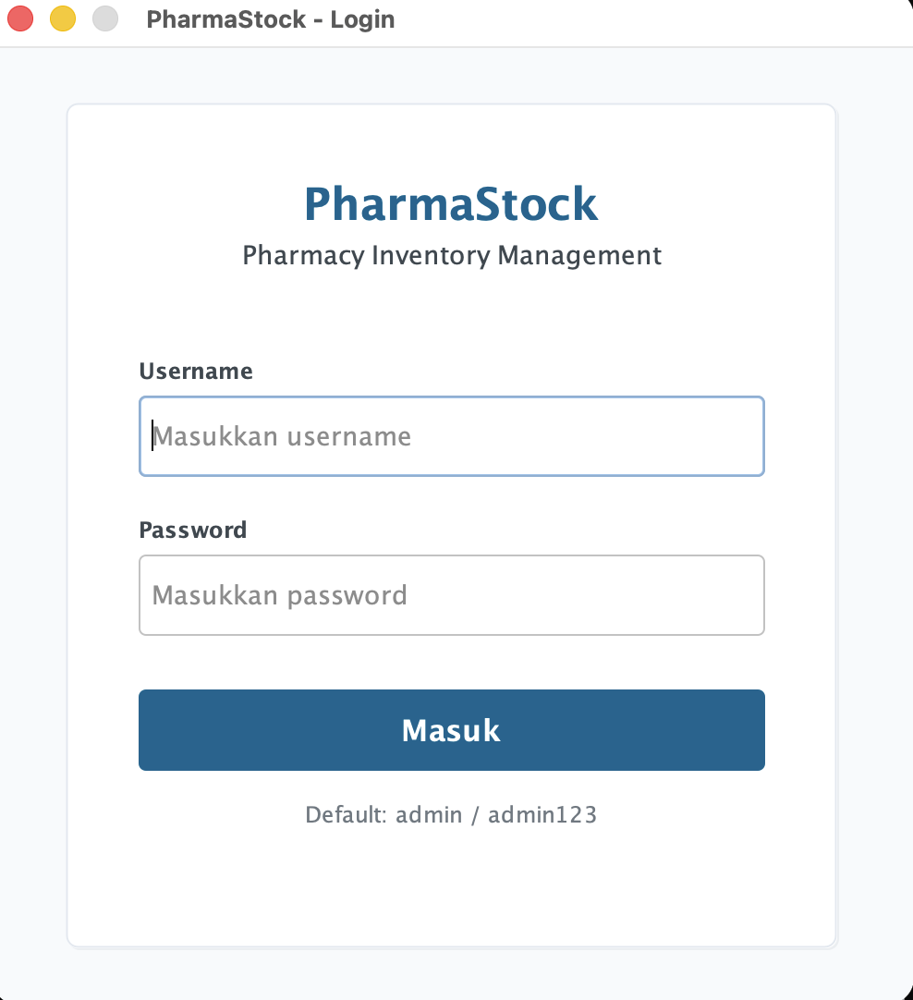
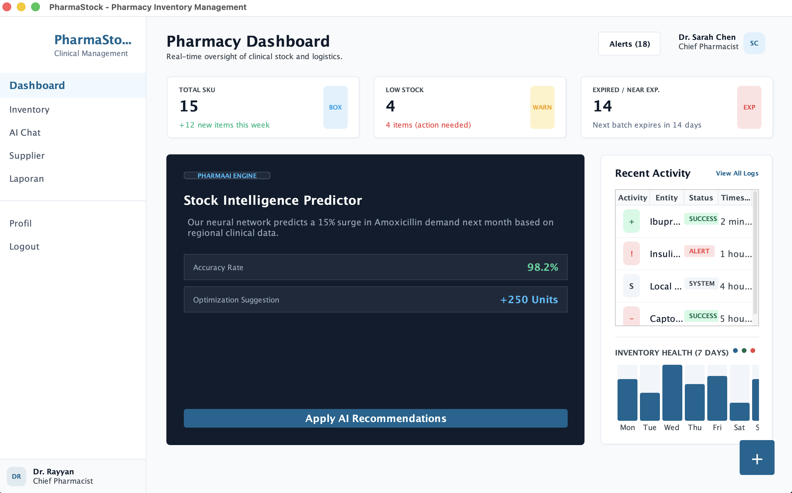
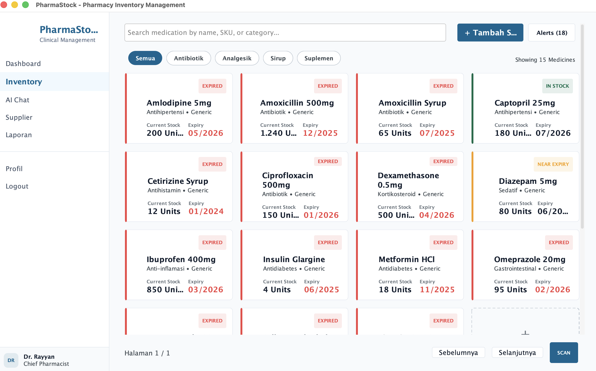
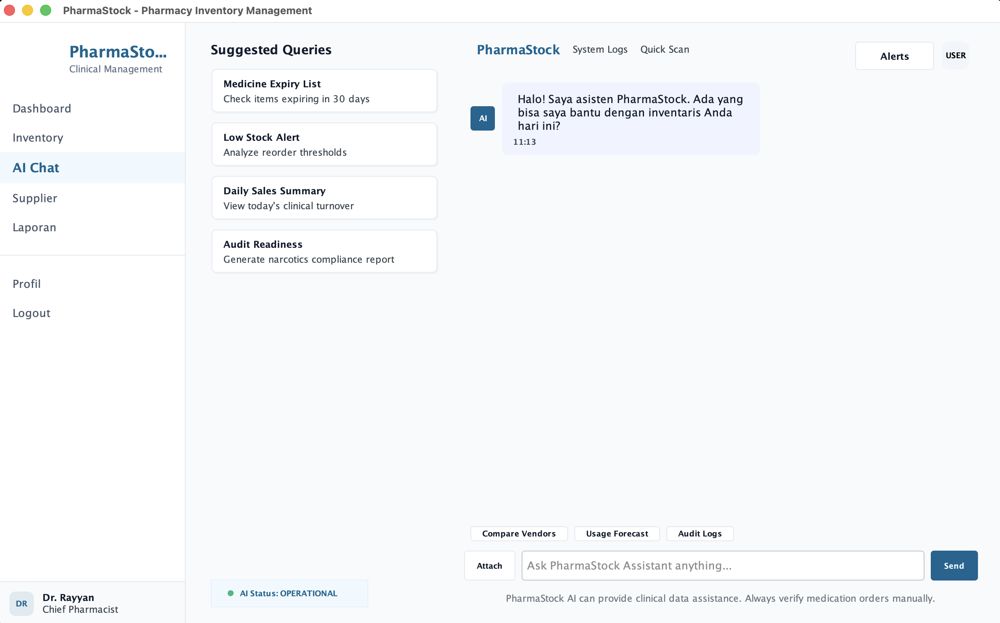
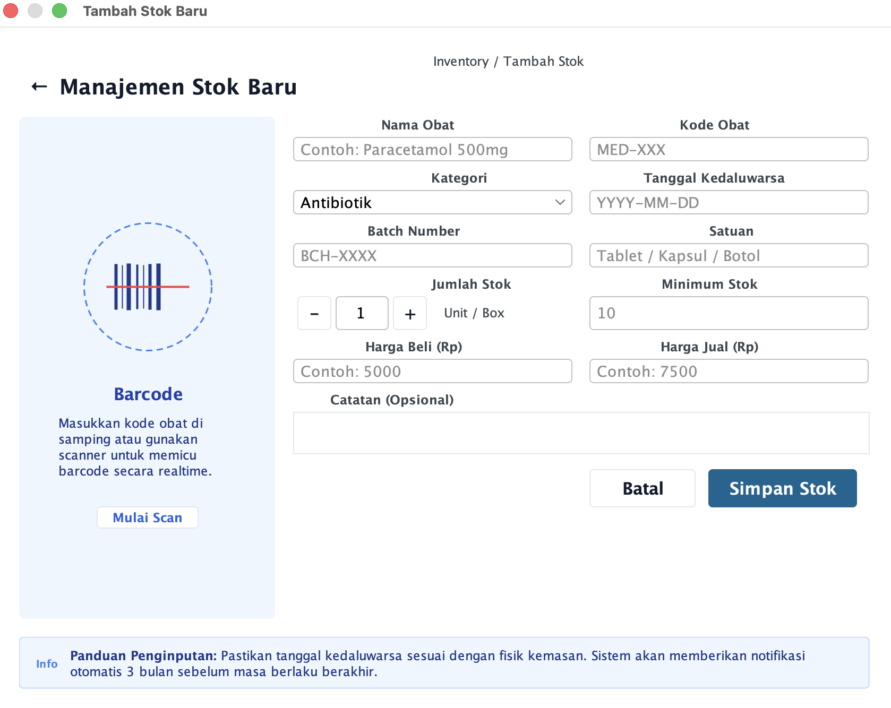
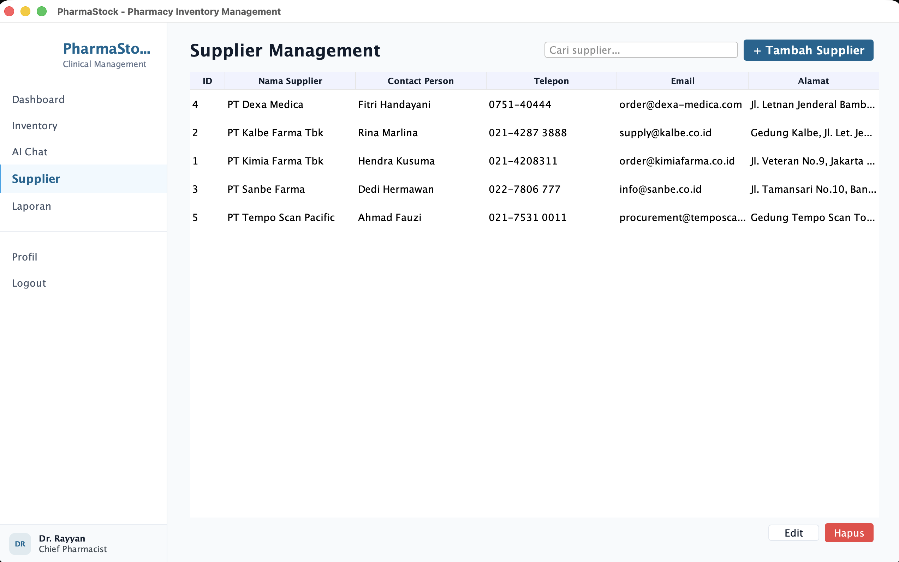
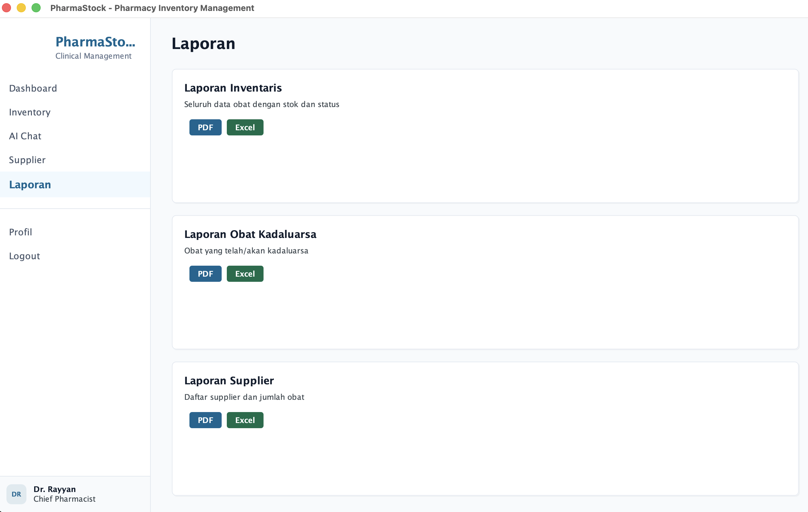

# KEPO

Kendali Evakuasi dan Pengelolaan Operasional Bencana — Sistem Manajemen Evakuasi & Penanggulangan Bencana Berbasis AI.

---

## Screenshots

| Login | Dashboard | Inventory |
|:---:|:---:|:---:|
|  |  |  |

| AI Chat | Scan Barcode | Supplier | Laporan |
|:---:|:---:|:---:|:---:|
|  |  |  |  |

---

## Fitur Utama

| Fitur | Deskripsi |
|---|---|
| **Authentication** | Login dengan BCrypt password hashing. 3 role: ADMIN, PHARMACIST, STAFF. |
| **Dashboard** | Total SKU, total stok, stok rendah, kadaluarsa, pertumbuhan bulanan, aktivitas terbaru. |
| **Inventory CRUD** | Create, read, update, delete obat dengan validasi lengkap. |
| **Stok Management** | Stok masuk (IN), stok keluar (OUT), penyesuaian (ADJUSTMENT) dengan logging otomatis. |
| **Pagination & Search** | Pencarian by nama/kode, filter kategori/status, pengurutan kolom. |
| **Barcode / QR Code** | Generate Code128 barcode dan QR code (ZXing), scan & lookup. |
| **Supplier Management** | CRUD supplier dengan validasi, pencegahan hapus jika masih ada obat terkait. |
| **AI Recommendations** | Reorder otomatis, alert kadaluarsa, analisis fast/slow/dead stock, demand forecasting. |
| **AI Chat Assistant** | Chatbot interaktif: Local rule-based, Google Gemini, atau OpenAI. Context-aware dari data inventaris live. |
| **Report Generation** | 4 template JasperReports: Inventaris, Kadaluarsa, Pergerakan Stok, Supplier. Export PDF & Excel. |
| **Notification System** | Notifikasi real-time untuk stok rendah, obat kadaluarsa, dan mendekati kadaluarsa. |
| **Modern UI** | FlatLaf-based Swing UI dengan design tokens, rounded panels, status badges, chat bubbles. |

---

## Tech Stack

| Dependency | Version | Purpose |
|---|---|---|
| Java | 21 | Language & runtime (LTS) |
| PostgreSQL JDBC Driver | 42.7.2 | JDBC driver |
| HikariCP | 5.1.0 | Connection pool |
| ZXing | 3.5.3 | Barcode & QR code |
| JasperReports | 6.21.3 | Report generation |
| JFreeChart | 1.5.4 | Charting |
| Jackson | 2.17.0 | JSON processing |
| BCrypt | 0.10.2 | Password hashing |
| FlatLaf | 3.4.1 | Modern Swing L&F |
| SLF4J | 2.0.12 | Logging |
| Apache POI | 5.2.5 | Excel export |

---

## Arsitektur

```
┌─────────────────────────────────────────────────┐
│                   VIEW LAYER                     │
│  Swing UI: Panels, Dialogs, Components          │
├─────────────────────────────────────────────────┤
│                CONTROLLER LAYER                  │
│  Mediates between View and Service              │
├─────────────────────────────────────────────────┤
│                 SERVICE LAYER                    │
│  Business logic, orchestration, validation      │
├─────────────────────────────────────────────────┤
│               REPOSITORY LAYER                  │
│  Data access via raw JDBC + HikariCP            │
├─────────────────────────────────────────────────┤
│                  MODEL LAYER                    │
│  POJOs + Enums                                  │
├─────────────────────────────────────────────────┤
│                CONFIG LAYER                     │
│  AppConfig (.env), DatabaseConfig (Singleton)   │
└─────────────────────────────────────────────────┘
```

- **No ORM** — Semua database access manual JDBC + ResultSet mapping
- **Repository Pattern** — `BaseRepository<T>` generic interface
- **Strategy Pattern** — `AIProvider` interface dengan 3 implementasi
- **Singleton** — `DatabaseConfig` (HikariCP)
- **Manual DI** — Wiring di `KepoApp.main()`

---

## Database Schema

**Engine:** PostgreSQL 9.4+ | **Database:** `kepo`

### ER Diagram

```
┌──────────────┐       ┌──────────────────┐       ┌─────────────────────┐
│    users     │       │    medicines     │       │ inventory_transactions│
├──────────────┤       ├──────────────────┤       ├─────────────────────┤
│ user_id (PK) │       │ medicine_id (PK) │◄──┐   │ transaction_id (PK) │
│ username     │       │ medicine_code    │   │   │ medicine_id (FK)    │
│ password_hash│       │ medicine_name    │   └───│ transaction_type    │
│ full_name    │       │ category         │       │ quantity            │
│ role         │       │ batch_number     │       │ transaction_date    │
│ created_at   │       │ unit             │       │ notes               │
│ updated_at   │       │ stock_quantity   │       └─────────────────────┘
└──────────────┘       │ minimum_stock    │
                       │ purchase_price   │       ┌──────────────┐
                       │ selling_price    │       │  suppliers   │
                       │ expiry_date      │       ├──────────────┤
                       │ supplier_id (FK) │──────▶│ supplier_id  │
                       │ created_at       │       │ supplier_name│
                       │ updated_at       │       │ contact_person│
                       └──────────────────┘       │ phone        │
                                                  │ email        │
                                                  │ address      │
                                                  └──────────────┘
```

---

## Struktur Project

```
pbo-project/
├── .env                          # Environment configuration
├── .env.example                  # Template .env
├── .gitignore
├── pom.xml                       # Maven build
├── reports/                      # Generated reports (PDF, XLSX)
├── resource-ui/                  # UI mockups & screenshots
│   └── ui/
│       ├── login.png
│       ├── dashboard.png
│       ├── inventory.png
│       ├── ai-chat.png
│       ├── scan-barcode.png
│       ├── supplier.png
│       └── laporan.png
└── src/main/
    ├── java/com/kepo/
    │   ├── Main.java
    │   ├── KepoApp.java
    │   ├── config/               # AppConfig, DatabaseConfig
    │   ├── controller/           # 5 Controllers
    │   ├── model/                # 6 Entities
    │   ├── repository/           # 10 Files (4 interfaces + 4 impl + 2 base)
    │   ├── service/              # 7 Services
    │   ├── service/ai/           # AIProvider + 3 implementations
    │   ├── util/                 # Barcode, Date, Password, Validation
    │   └── view/                 # UI Panels, Dialogs, Components
    └── resources/
        ├── database/
        │   ├── schema.sql        # DDL (4 tables)
        │   └── seed.sql          # Demo data
        └── reports/              # JasperReports templates (.jrxml)
```

---

## Konfigurasi

Buat file `.env` di root project (lihat `.env.example`):

```env
# Database (PostgreSQL)
DB_URL=jdbc:postgresql://localhost:5432/kepo
DB_USERNAME=postgres
DB_PASSWORD=
DB_POOL_SIZE=10

# AI Provider: LOCAL, OPENAI, GEMINI
AI_PROVIDER=GEMINI

# Gemini (optional)
AI_GEMINI_API_KEY=your_api_key_here
AI_GEMINI_MODEL=gemini-2.5-flash-lite

# OpenAI (optional)
AI_OPENAI_API_KEY=
AI_OPENAI_MODEL=gpt-3.5-turbo
```

---

## Setup & Menjalankan

```bash
# 1. Clone repository
git clone <url>
cd pbo-project

# 2. Buat database PostgreSQL
createdb -U postgres kepo
# Atau masuk ke psql/pgAdmin: CREATE DATABASE kepo;

# 3. Setup environment
cp .env.example .env
# Edit .env dengan konfigurasi Anda

# 4. Build & run
mvn clean compile exec:java -Dexec.mainClass="com.kepo.Main"

# Atau build fat JAR
mvn clean package
java -jar target/kepo-2.0.0.jar
```

---

## AI Provider

| Provider | Mode | Kebutuhan |
|---|---|---|
| `LOCAL` | Rule-based offline | Tidak perlu API key |
| `GEMINI` | Google Gemini API | API key dari [Google AI Studio](https://aistudio.google.com/apikey) |
| `OPENAI` | OpenAI ChatGPT | API key dari [OpenAI Platform](https://platform.openai.com/api-keys) |

---

## License

MIT
# analytics-stok-drug
